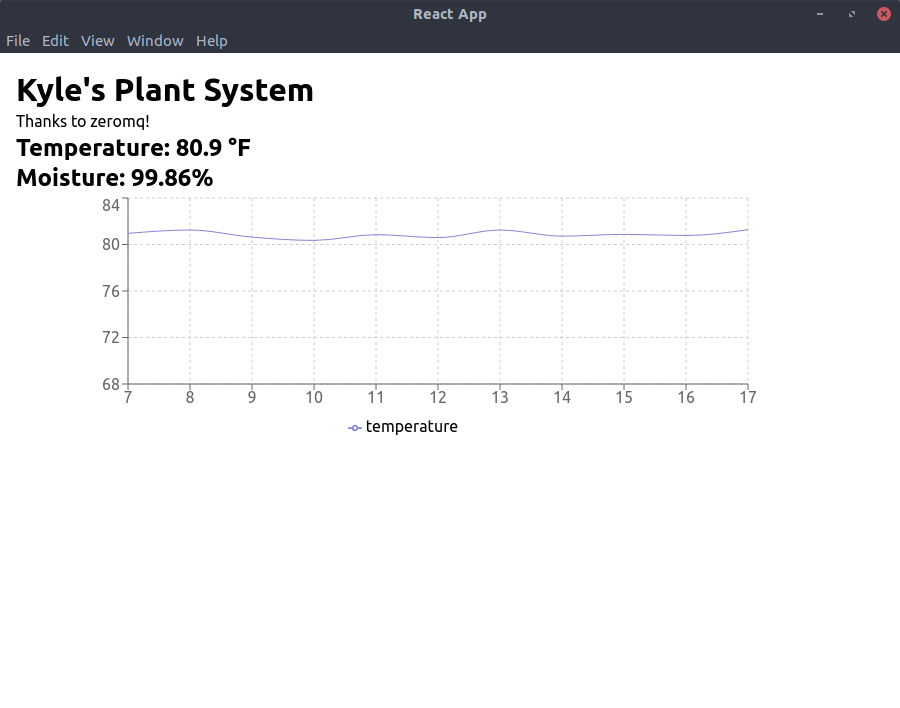
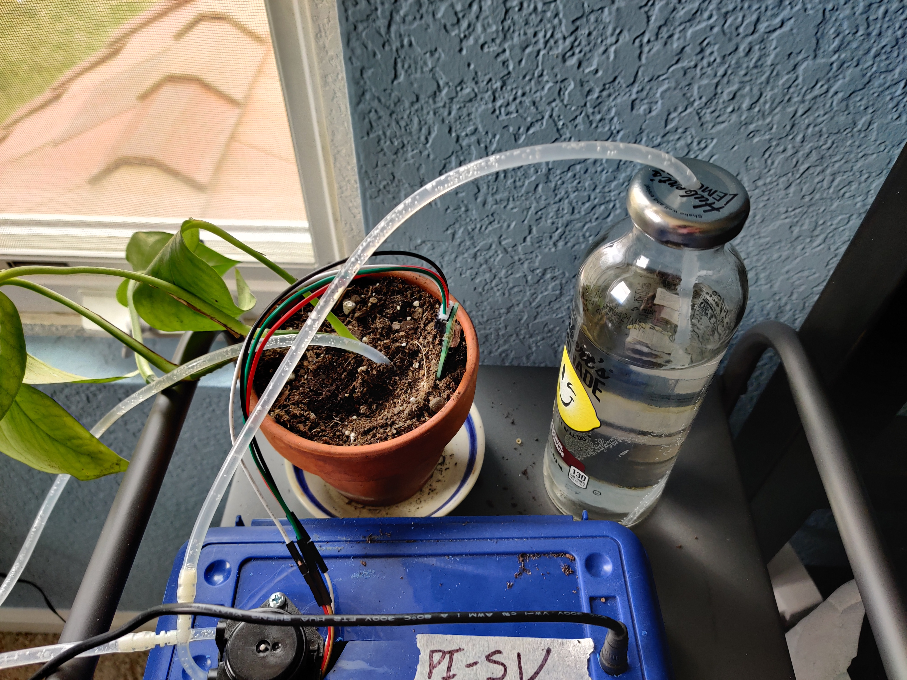

## Overview

Due to coronavirus, I have come back home from college. I have been keeping busy by doing some more
self-learning and tinkering with electronics. I had the materials lying around to create a raspberry
pi powered plant watering system, so I created one! I wanted the pi to send data to a webserver to
live update stats on the plant's vitals, temperature, and moisture. So here we go!

This was by no means cheap, but the project nevertheless was enjoyable to make.

### Materials:

|                                                     Item | Price in \$ |
| -------------------------------------------------------: | :---------- |
|    [Raspberry Pi](https://www.adafruit.com/product/3055) | 35          |
|            [Pump](https://www.adafruit.com/product/1150) | 25          |
|     [Soil Sensor](https://www.adafruit.com/product/4026) | 7.50        |
| [N-channel MOSFET](https://www.adafruit.com/product/355) | 1.75        |
| [12V Power Supply](https://www.adafruit.com/product/798) | 9           |
| [DC Power Adapter](https://www.adafruit.com/product/368) | 2           |
|                                                **Total** | **80.25**   |

#### Extras (not strictly necessary):

|                                                      Item | Price in \$ |
| --------------------------------------------------------: | :---------- |
| [JST Socket Cable](https://www.adafruit.com/product/3950) | 1.5         |
|                [Wires](https://www.adafruit.com/?q=wires) | Varies      |

### The Pi

#### Circuit

I am using an N-channel MOSFET to control the flow of electricity to the pump. The pump is on a 12V
line, and the raspberry pi is on a 5V line. If I powered the raspberry with the pumps power supply I
**would fry the raspberry pi** (which I have done by miss wiring the MOSFET). The orange line is
connected to the gpio pin for the pump (this can be whatever, in my case, it is gpio pin 14). This
turns on/off the pump by allowing the pump's circuit to be complete, allowing for current to flow.

> If you are using a different IO device, make sure the the soil sensor is powered by the default
> voltage of the device.


#### The Code

Please take a look at the full [code repo here](https://github.com/kpfromer/soil-sensor).

##### Enable SSH/SPI/I2C

To connect to the soil sensor we need to enable SPI and I2C. I also recommend enabling SSH to
connect to the raspberry pi in the future. To enable these feature run:

```bash
sudo raspi-config
```

It will open like this:


Open the "Interfacing Options" window.


Enable the option, do this for the rest


##### Python Dependencies

**Requirements:**

```bash
# Update/Upgrade
sudo apt update
sudo apt upgrade
# python3 tools
sudo apt install python3 python3-pip python3
# gpiozero
sudo apt install python3-gpiozero
# Stemma Soil Sensor
sudo pip3 install adafruit-circuitpython-seesaw
# Zeromq
sudo pip3 install pyzmq
```

**TL;DR**

```bash
sudo apt update && sudo apt upgrade -y && sudo apt install -y python3 python3-pip python3 python3-gpiozero && sudo pip3 install adafruit-circuitpython-seesaw pyzmq
```

##### Python Code

**/home/pi/soil.py**

```python
import time
# for pump
from gpiozero import LED
# for soil
import busio
from board import SCL, SDA
from adafruit_seesaw.seesaw import Seesaw
import zmq

# zeromq publisher/subscriber pattern
context = zmq.Context()
socket = context.socket(zmq.PUB)
socket.bind("tcp://*:5555")


# i2c for soil sensor
i2c_bus = busio.I2C(SCL, SDA)
ss = Seesaw(i2c_bus, addr=0x36)

# pump
pump = LED(14)

while True:
    # read moisture level through capacitive touch pad
    touch = ss.moisture_read()
    # read temperature from the temperature sensor
    temp = ss.get_temp()
    # turn on/off pump
    if touch < 500:
        pump.on()
    else:
        pump.off()
    print("Temperature C: {} Moisture: {}".format(temp, touch))
    # send data with publisher/subscriber pattern with zeromq
    socket.send_json({'temperature': temp, 'moisture': touch})
    time.sleep(1)
```

To enable the soil python script on boot I am using a `systemd` service, which is simple and clean,
and cron jobs are kind of pain.

**/etc/systemd/system/soil.service**

```
[Unit]
Description=Soil Waterer
StartLimitIntervalSec=0
[Service]
Type=simple
Restart=always
RestartSec=1
User=pi
ExecStart=/usr/bin/env python3 /home/pi/soil.py

[Install]
WantedBy=multi-user.target
```

Once the system file is created you should to enable it to run on boot:

```bash
sudo systemctl enable soil
```

To start it immediatly run:

```bash
sudo systemctl start soil
```

### The Client/Webserver

I wanted a way to get live stats from the sensor, so I thought about various forms of sending data.
I tried using UNIX sockets to send data from the Python script to a nodejs express web server, but
that was very flimsy. I then settled on using [zeromq](https://zeromq.org/), which is absolutely
beautiful. The way it is structured, the python script creates a publisher/subscriber pattern and
sends data to any subscriber. Any subscriber can tap into that data and use it in their application.
I then created an Electron Desktop application with ReactJS. Electron is needed since zeromq
requires nodejs libraries and makes building a GUI very easy.

#### A Simple Test

To make sure I was actually getting the zeromq data, I created a simple script on a different
computer to see if I was getting the data (based on
[nodejs zeromq readme](https://zeromq.org/languages/nodejs/)). It worked perfectly!

```typescript
import zmq from 'zeromq';
const sock = zmq.socket('sub'); // subscriber

sock.connect('tcp://IP_ADDRESS:5555');
sock.subscribe(''); // No topic
console.log('Connected');

sock.on('message', (message) => {
  // Convert message to JSON
  const json = JSON.parse(message.toString());
  console.log(json);
});
```

#### Creating Electron React App

Setuping up Electron with React is simple, but I always forget how. I often find myself following
[Randy Findley's guide](https://www.codementor.io/@randyfindley/how-to-build-an-electron-app-using-create-react-app-and-electron-builder-ss1k0sfer)
which I am going to summarize below (**please read his**).

##### Install

So first create the react app with
[`create-react-app`](https://github.com/facebook/create-react-app). I wanted to use TypeScript and
yarn so I included those options.

```bash
npx create-react-app soil-electron --template typescript --use-yarn
```

Then in `soil-electron` we have to add electron.

```bash
yarn add --dev electron electron-builder
```

And then some development tools.

```bash
yarn add electron-is-dev
yarn add --dev wait-on concurrently
```

Then we need to create `public/electron.js` to bootstrap electron.

```javascript
const { app, BrowserWindow } = require('electron');
const path = require('path');
const isDev = require('electron-is-dev');

let mainWindow;

function createWindow() {
  mainWindow = new BrowserWindow({ width: 900, height: 680 });
  mainWindow.loadURL(
    isDev ? 'http://localhost:3000' : `file://${path.join(__dirname, '../build/index.html')}`
  );
  if (isDev) {
    // Open the DevTools.
    //BrowserWindow.addDevToolsExtension('<location to your react chrome extension>');
    mainWindow.webContents.openDevTools();
  }
  mainWindow.on('closed', () => (mainWindow = null));
}

app.on('ready', createWindow);

app.on('window-all-closed', () => {
  if (process.platform !== 'darwin') {
    app.quit();
  }
});

app.on('activate', () => {
  if (mainWindow === null) {
    createWindow();
  }
});
```

###### Using Rescripts to Get Access to IPC (interprocess communication)

Then to use electron nodejs based libraries we need to install and setup rescripts.

```bash
yarn add --dev @rescripts/cli @rescripts/rescript-env
```

Then create `.rescriptsrc.js`

```javascript
module.exports = [require.resolve('./.webpack.config.js')];
```

And create `.webpack.config.js`

```javascript
module.exports = (config) => {
  config.target = 'electron-renderer';
  return config;
};
```

Finally, update the scripts of `package.json` to use rescripts instead of the default
`react-scripts`

```javascript

{
  // rest of package.json
  "scripts": {
    // other scripts
    "start": "rescripts start",
    "build": "rescripts build",
    "test": "rescripts test"
  }
}
```

###### Fixes for zeromq

I had issues building the electron binary with zeromq and found that I need to rebuild electron with
zeromq. To do so install `electron-rebuild`:

```bash
yarn add electron-rebuild
```

And then add the script, to `package.json` to run on package install (aka `yarn install`).

```javascript
{
  // rest of package.json
  "scripts": {
    // other scripts
    "rebuild": "electron-rebuild",
    "install": "yarn rebuild"
  }
}
```

###### IPC Setup

I used `electron-better-ipc` to better ipc with the react frontend and electron backend. Here's the
updated code for the electron code (`public/electron.js`).

```javascript
const electron = require('electron');
const { ipcMain: ipc } = require('electron-better-ipc');
const { app, BrowserWindow } = electron;
const path = require('path');
const isDev = require('electron-is-dev');
const zmq = require('zeromq');

let mainWindow;

function createWindow() {
  mainWindow = new BrowserWindow({
    width: 900,
    height: 680,
    webPreferences: { nodeIntegration: true }
  });
  mainWindow.loadURL(
    isDev ? 'http://localhost:3000' : `file://${path.join(__dirname, '../build/index.html')}`
  );
  if (isDev) {
    // Open the DevTools.
    //BrowserWindow.addDevToolsExtension('<location to your react chrome extension>');
    mainWindow.webContents.openDevTools();
  }
  mainWindow.on('closed', () => (mainWindow = null));
}

app.on('ready', createWindow);

app.on('window-all-closed', () => {
  if (process.platform !== 'darwin') {
    app.quit();
  }
});

app.on('activate', () => {
  if (mainWindow === null) {
    createWindow();
  }
});

const sock = zmq.socket('sub');
sock.connect('tcp://192.168.0.107:5555');
sock.subscribe(''); // python zeromq has no topic option
console.log('Subscriber connected to port 5555');

let data;

sock.on('message', (zeromqData) => {
  data = JSON.parse(zeromqData.toString());
  console.log(data);
});

setInterval(() => {
  ipc.callRenderer(mainWindow, 'data', data);
}, 1000);
```

##### Frontend Code

Then I connected the frontend react code to electron to update some text and a graph. I am using
[rebass](https://rebassjs.org/) for styling and [recharts](https://recharts.org/) for graphing.

**src/index.tsx**

```typescript
import React, { useEffect, useState } from 'react';
import { Box, Heading, Flex, Text } from 'rebass';
import { LineChart, CartesianGrid, XAxis, YAxis, Tooltip, Legend, Line } from 'recharts';
const { ipcRenderer: ipc } = window.require('electron-better-ipc');

function toPrecision(number: number, precision: number) {
  return Math.floor(Math.pow(10, precision) * number) / Math.pow(10, precision);
}

function App() {
  const [temp, setTemp] = useState<{ time: number; temperature: number }[]>([]);
  const [data, setData] = useState({ temperature: 0, moisture: 0 });

  useEffect(() => {
    const removeListener = ipc.answerMain(
      'data',
      (data: { temperature: number; moisture: number }) => {
        setData(data);
        setTemp((temp) =>
          [
            ...temp,
            {
              time: temp.length > 0 ? temp[temp.length - 1].time + 1 : 1,
              temperature: toPrecision((data.temperature * 212) / 100 + 32, 2)
            }
          ].slice(Math.max(0, temp.length - 10))
        );
      }
    );
    return removeListener;
  }, []);

  return (
    <Flex mx="auto" p={3}>
      <Box width="80%" sx={{ maxWidth: 1250 }}>
        <Heading fontSize={5}>Kyle's Plant System</Heading>
        <Text>Thanks to zeromq!</Text>
        <Heading>Temperature: {toPrecision((data.temperature * 212) / 100 + 32, 2)} °F</Heading>
        <Heading>Moisture: {toPrecision((data.moisture / 1015) * 100, 2)}%</Heading>
        <Box ml={4}>
          <LineChart
            width={730}
            height={250}
            data={temp}
            min
            margin={{ top: 5, right: 30, left: 20, bottom: 5 }}
          >
            <CartesianGrid strokeDasharray="3 3" />
            <XAxis dataKey="time" />
            <YAxis domain={[70, 'auto']} />
            <Tooltip />
            <Legend />
            <Line type="monotone" dataKey="temperature" stroke="#8884d8" />
          </LineChart>
        </Box>
      </Box>
    </Flex>
  );
}

export default App;
```

**src/App.tsx**

```typescript
import React from 'react';
import ReactDOM from 'react-dom';
import App from './App';
import * as serviceWorker from './serviceWorker';
import { ThemeProvider } from 'theme-ui';
import preset from '@rebass/preset';

ReactDOM.render(
  <React.StrictMode>
    <ThemeProvider theme={preset}>
      <App />
    </ThemeProvider>
  </React.StrictMode>,
  document.getElementById('root')
);

serviceWorker.unregister();
```

# Final Product

And there you go! Now you have a working soil sensor that can send data to clients and turn on the
pump when needed! I plan on making it better by adjusting the pump start moisture and allowing for
clients to change that trigger via the application.





